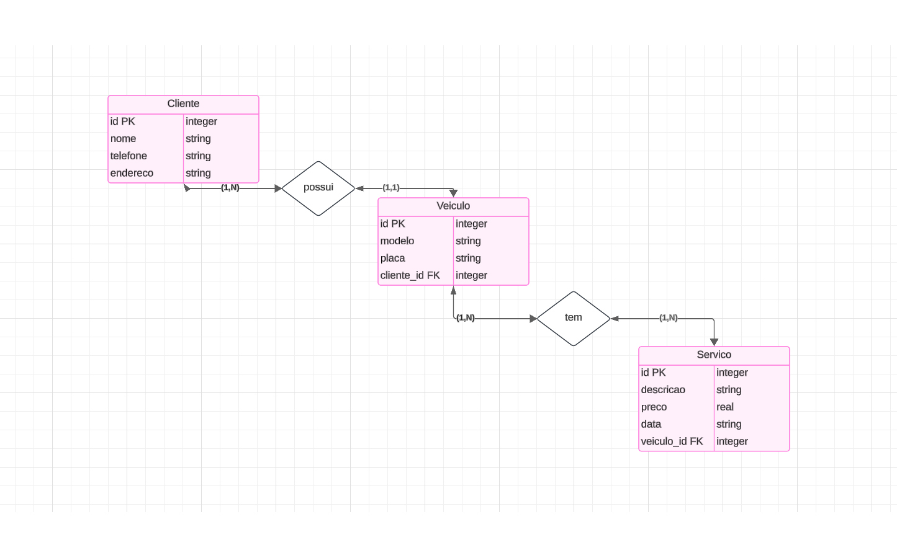
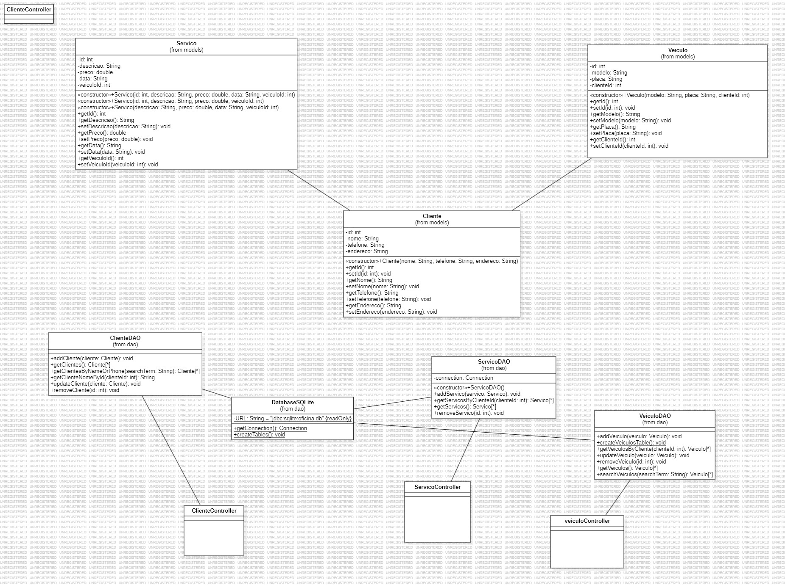
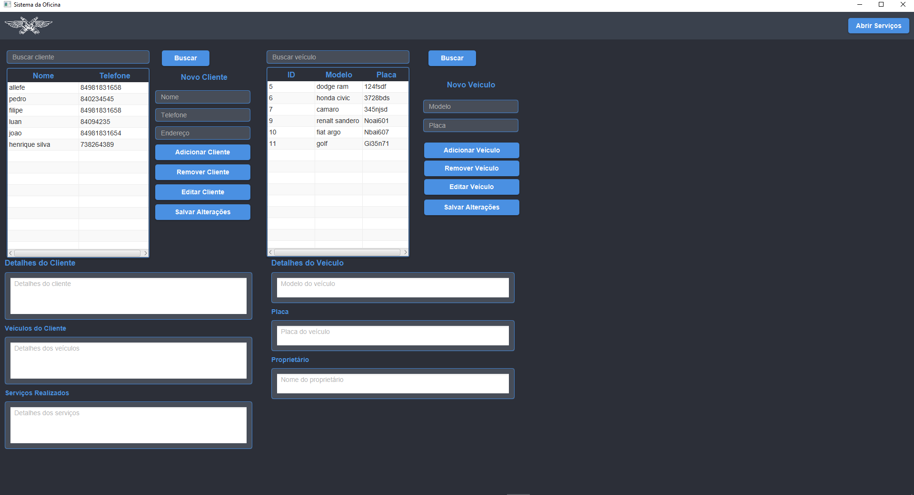
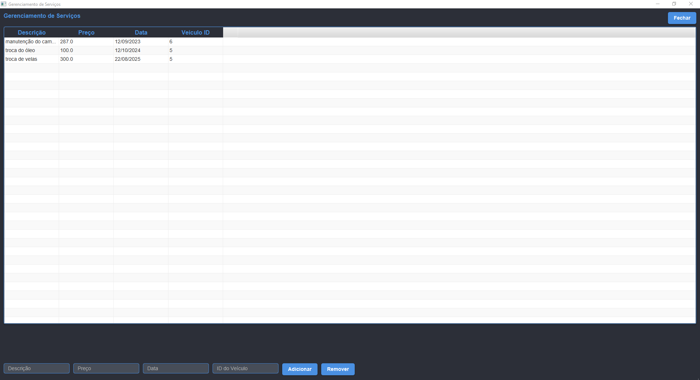

# Sistema de Gerenciamento de Oficina Mecânica

Este é um projeto Java desenvolvido com JavaFX utilizando a arquitetura MVC (Model-View-Controller) e banco de dados SQLite. O objetivo é oferecer um sistema para gerenciar clientes, veículos e serviços realizados em uma oficina mecânica.

---

## Estrutura do Projeto

O projeto está organizado nos seguintes pacotes:

- **application**: Contém a classe principal responsável por inicializar o aplicativo.
- **models**: Classes que representam as entidades do sistema (ex.: Cliente, Veículo, Serviço).
- **controller**: Controladores responsáveis por lidar com a lógica entre a interface gráfica e os dados.
- **DAO**: Classes de acesso ao banco de dados (Data Access Object).
- **views**: Arquivos FXML e componentes relacionados às telas do sistema.
- **resources**: Arquivos estáticos, como imagens e arquivos de estilo (CSS).

---

## Funcionalidades

- **Gerenciamento de Clientes**: Adicionar, editar e visualizar clientes.
- **Gerenciamento de Veículos**: Associar veículos a clientes e gerenciar informações dos veículos.
- **Gerenciamento de Serviços**: Adicionar serviços realizados, associando-os a clientes e veículos.

---

## Banco de Dados

O sistema utiliza o banco de dados SQLite. O código SQL para criação das tabelas foi desenvolvido diretamente no Eclipse utilizando um plugin do SQLite.

### Diagrama de Relações do Banco de Dados



---

## Estrutura do Código

O projeto segue o padrão de arquitetura MVC. Abaixo está o diagrama de classes que representa a estrutura do código.

### Diagrama de Classes



---

## Telas do Sistema

### Dashboard Principal

A tela principal do sistema, que oferece acesso às funcionalidades de gerenciamento.



### Dashboard de Gerenciamento de Serviços

Tela para adicionar e gerenciar serviços realizados.



---

## Tecnologias Utilizadas

- **Java 17**: Linguagem de programação utilizada.
- **JavaFX**: Framework para desenvolvimento da interface gráfica.
- **SQLite**: Banco de dados utilizado no projeto.
- **Scene Builder**: Ferramenta para construir interfaces gráficas (FXML).

---

## Como Executar o Projeto

1. Clone este repositório:
   ```bash
   git clone https://github.com/allefe1/mecanicaProjeto
